<!-- @import "[TOC]" {cmd="toc" depthFrom=1 depthTo=6 orderedList=false} -->

<!-- code_chunk_output -->

- [5060显卡驱动PyCUDA开发环境搭建](#5060显卡驱动pycuda开发环境搭建)
  - [1.1 开机后Ubuntu2404LTS不识别显卡](#11-开机后ubuntu2404lts不识别显卡)
    - [1.1.1 显卡硬件规格要求](#111-显卡硬件规格要求)
    - [1.1.2 最新系统默认不识别显卡](#112-最新系统默认不识别显卡)
    - [1.1.3 尝试安装系统源里驱动结果白屏](#113-尝试安装系统源里驱动结果白屏)
  - [1.2 官方驱动安装及PyCUDA安装](#12-官方驱动安装及pycuda安装)
    - [1.2.1 英伟达官方驱动下载安装](#121-英伟达官方驱动下载安装)
    - [1.2.2 CUDA toolkit 12.9 和driver安装](#122-cuda-toolkit-129-和driver安装)
    - [1.2.3 PyCUDA虚拟环境安装运行](#123-pycuda虚拟环境安装运行)
  - [1.3 小结](#13-小结)

<!-- /code_chunk_output -->

### 5060显卡驱动PyCUDA开发环境搭建

本文手把手讲解了RTX5060ti显卡从上手尝试折腾，到在最新Ubuntu LTS版本上CUDA开发环境搭建成功的详细流程。

#### 1.1 开机后Ubuntu2404LTS不识别显卡

##### 1.1.1 显卡硬件规格要求

笔者下单的铭瑄电竞之心，安装规格是PCIe 5.0 x16，全长插槽，普通入门主板PCIe4.0都可以使用。电源建议650W及以上，应该是主机整体供电的要求，5060显卡本身只有180W的额定功率，在满载情况下有双倍冗余已经足够，主机其他设备加起来也有300W的功率。这样的要求大部分入门主机可以满足。


另外，经测试普通oculink协议的550W显卡坞，连接笔记本的M2转oculink接口后完美使用，驱动安装后工作正常如图所示。

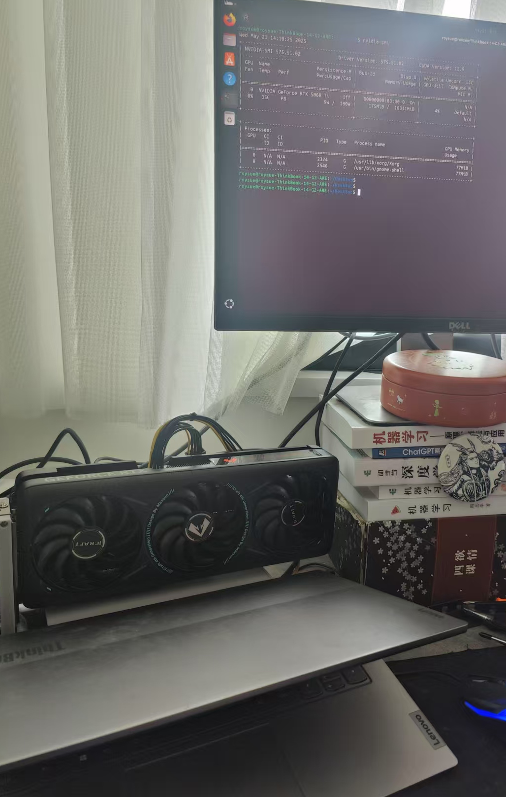

##### 1.1.2 最新系统默认不识别显卡

由于RTX5060ti是在Ubuntu2404LTS后面出的，所以不识别也可以理解。

>PS：官方列出的Ubuntu源中的英伟达显卡驱动都会无法安装，安装后会白屏黑屏进不去系统
https://documentation.ubuntu.com/server/how-to/graphics/install-nvidia-drivers/index.html

- 使用系统自带驱动版本检测会失败

```bash
$ sudo nvidia-detector 
[sudo] password for roysue: 
None
```

正常情况下会返回APT源中支持该硬件的驱动文件名，如`nvidia-driver-550`。使用`sudo ubuntu-drivers list`也会返回空，没有推荐的驱动程序。

- 查看显卡硬件参数

查看PCI设备，显示英伟达公司产品，没有具体型号，只有代号2d04。

```bash
$ sudo lspci |grep -i nvidia
03:00.0 VGA compatible controller: NVIDIA Corporation Device 2d04 (rev a1)
03:00.1 Audio device: NVIDIA Corporation Device 22eb (rev a1)
```

查看显示设备，还是只有英伟达标识。

```bash
$ sudo lshw -c display
  *-display                 
       description: VGA compatible controller
       product: NVIDIA Corporation
       vendor: NVIDIA Corporation
       physical id: 0
       bus info: pci@0000:03:00.0
       logical name: /dev/fb0
       version: a1
       width: 64 bits
       clock: 33MHz
       capabilities: pm msi pciexpress msix vga_controller cap_list fb
       configuration: depth=32 latency=0 mode=1920x1080 visual=truecolor xres=1920 yres=1080
       resources: iomemory:40-3f iomemory:40-3f memory:d0000000-d3ffffff memory:460000000-46fffffff memory:480000000-481ffffff ioport:3000(size=128) memory:d4080000-d40fffff memory:d4040000-d407ffff memory:470000000-47fffffff memory:482000000-483ffffff
```

未来的Ubuntu26或28就会默认支持5060了，好比现在的Ubuntu24默认支持3060显卡一样。

##### 1.1.3 尝试安装系统源里驱动结果白屏

尝试安装系统源中最新驱动`nvidia-driver-570`

```bash
$ sudo apt update
$ sudo apt list |grep nvidia-driver

WARNING: apt does not have a stable CLI interface. Use with caution in scripts.

nvidia-driver-470/noble-updates,noble-security 470.256.02-0ubuntu0.24.04.1 amd64
nvidia-driver-510/noble 525.147.05-0ubuntu2 amd64
nvidia-driver-515/noble 525.147.05-0ubuntu2 amd64
nvidia-driver-520/noble 525.147.05-0ubuntu2 amd64
nvidia-driver-530/noble-updates,noble-security 535.230.02-0ubuntu0.24.04.1 amd64
nvidia-driver-535/noble-updates,noble-security 535.230.02-0ubuntu0.24.04.1 amd64
nvidia-driver-550/noble-updates,noble-security 550.144.03-0ubuntu0.24.04.1 amd64
nvidia-driver-570/noble-updates,noble-security 570.133.07-0ubuntu0.24.04.1 amd64

$ sudo apt install -y nvidia-driver-570

```

安装完成后重启进系统白屏，只能再`ssh`进入后删除已经安装的英伟达驱动：

```bash
sudo apt purge nvidia*
sudo apt purge libnvidia*
```

重启后成功回到没有驱动的状态进入系统。

#### 1.2 官方驱动安装及PyCUDA安装

##### 1.2.1 英伟达官方驱动下载安装

驱动搜索地址：https://www.nvidia.cn/geforce/drivers/，如下所示填写。

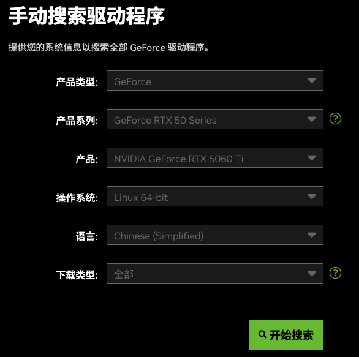

搜索结果有575的BETA版和570的正式版，575搭载的CUDA12.9，570是12.8，这里选择最新的575下载安装。

正式安装前先装下编译工具，否则后面可能报如图所示缺失cc、make等编译工具的报错。

```bash
$ sudo apt install -y build-essential
```

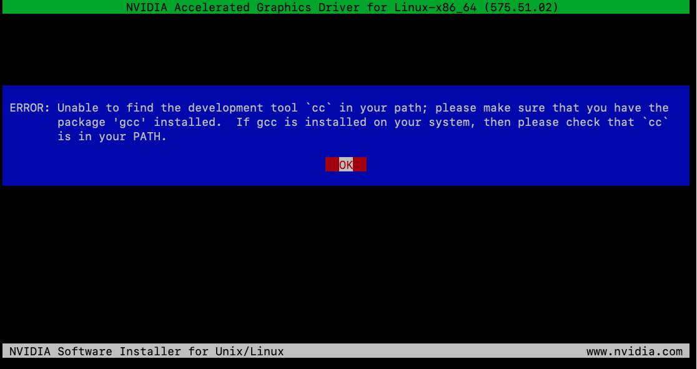


给运行权限后，以`root`权限安装：

```bash
$ sudo chmod 777 NVIDIA-Linux-x86_64-575.51.02.run
$ sudo ./NVIDIA-Linux-x86_64-575.51.02.run
```

第一个选择是内核模块种类用英伟达授权还是MIT/GPL授权，这里踩了大坑，选择前者会一直失败，内核模块无法加载，即使后续安装了英伟达的签名，关闭了BIOS里的Secure Boot也无济于事，选择后者MIT/GPL则一次通过；当然也有可能是BETA版本的问题，选择正式版驱动可能不会遇到此问题。

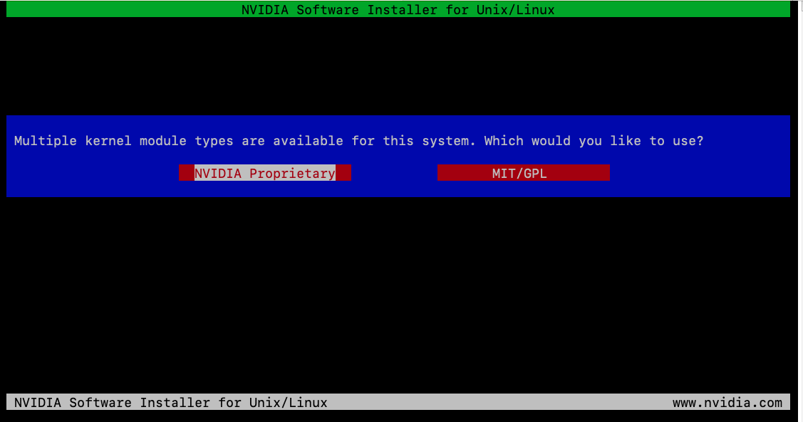

安装程序还会提示Ubuntu软件仓库里有系统官方维护的驱动程序要不要使用，前文已经试过了会失败，所以肯定不用，选择Continue installation。

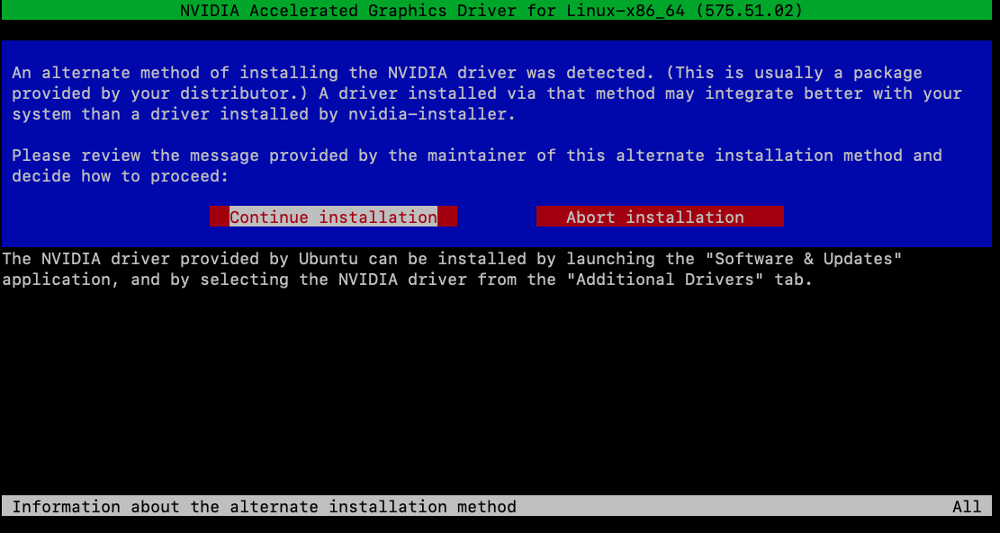

这个提示是系统里已经没有地方放32位驱动了，32位的显卡驱动文件不会被编译产生。

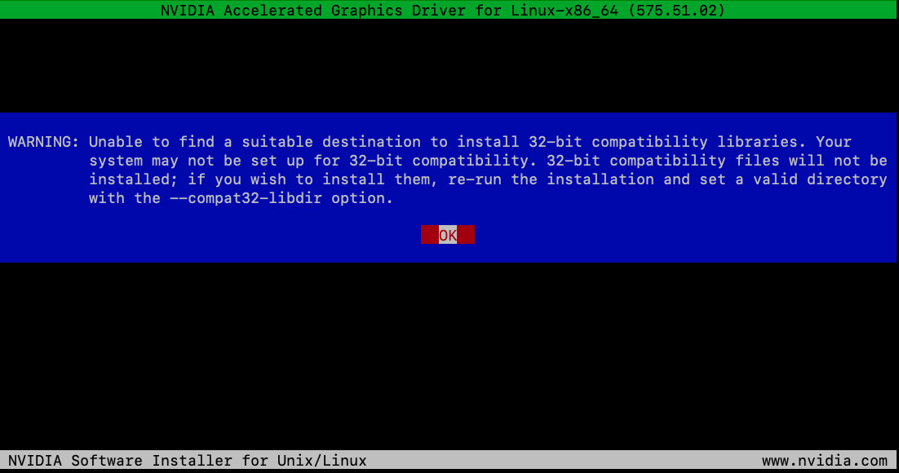

正常编译安装成功后会有如下提示。

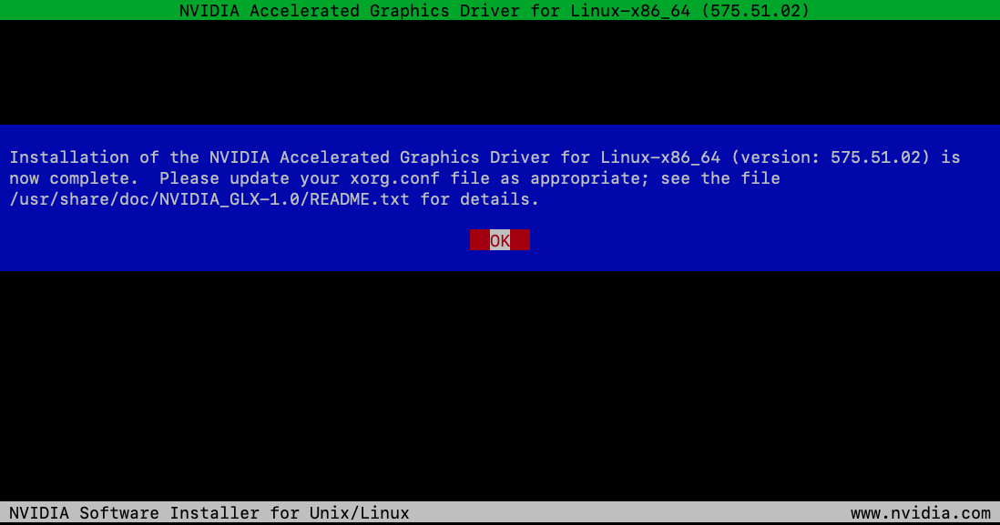

建议重启后再进入系统，可以运行`nvidia-smi`命令来查看5060ti显卡的实时信息了。

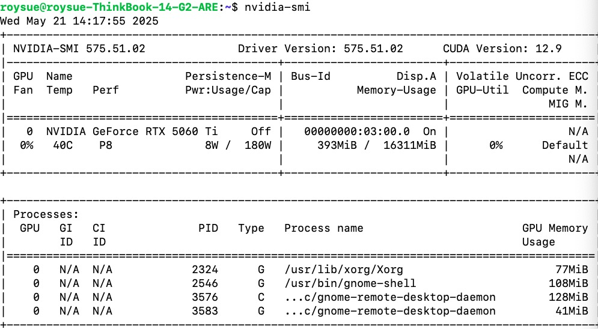

##### 1.2.2 CUDA toolkit 12.9 和driver安装

下载地址：https://developer.nvidia.com/cuda-downloads?target_os=Linux&target_arch=x86_64&Distribution=Ubuntu&target_version=24.04&target_type=deb_local

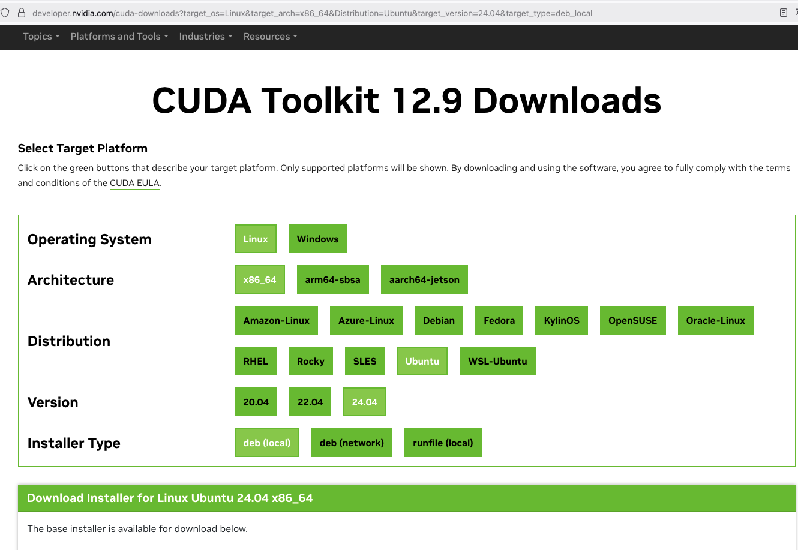

依次勾选Linux、x86_64、Ubuntu、24.04、deb(local)之后，会出现详细的安装命令。


```bash
$ wget https://developer.download.nvidia.com/compute/cuda/repos/ubuntu2404/x86_64/cuda-ubuntu2404.pinsudo 
$ mv cuda-ubuntu2404.pin /etc/apt/preferences.d/cuda-repository-pin-600
$ wget https://developer.download.nvidia.com/compute/cuda/12.9.0/local_installers/cuda-repo-ubuntu2404-12-9-local_12.9.0-575.51.03-1_amd64.deb
$ sudo dpkg -i cuda-repo-ubuntu2404-12-9-local_12.9.0-575.51.03-1_amd64.deb
$ sudo cp /var/cuda-repo-ubuntu2404-12-9-local/cuda-*-keyring.gpg /usr/share/keyrings/sudo apt-get update
$ sudo apt-get -y install cuda-toolkit-12-9
```

按照顺序安装即可，注意`deb`文件有四五个G，需要下载较长时间。

安装完成后重启，再安装最后的CUDA driver即可，前文选择的开源MIT/GPL授权的这里就选nvidia-open：

```bash
sudo apt-get install -y nvidia-open
```

装完成CUDA驱动后，必须重启进BIOS，关闭Secure Boot功能，再开机，否则驱动的内核模块可能会无法加载导致驱动加载失败。

再运行nvidia-smi中的型号信息Geforce RTX 5060 Ti都变成了NVIDIA Graphics Device，可能是BETA测试版导致的。

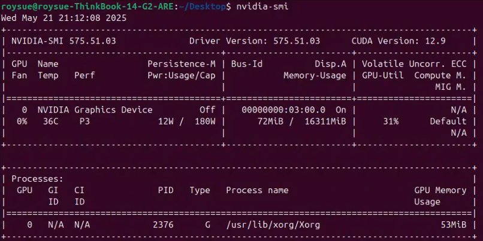

##### 1.2.3 PyCUDA虚拟环境安装运行

CUDA12.9安装完成后，并没有自动设置环境变量，导致后续安装PyCUDA编译时会报找不到CUDA.h的错误，此时必须手动设置下。

```bash
$ nano ~/.bashrc
```

文件末尾添加：

```bash
export PATH=/usr/local/cuda/bin:$PATH
export LD_LIBRARY_PATH=/usr/local/cuda/lib64:$LD_LIBRARY_PATH
```

退出后`source ~/.bashrc`立即生效。可以通过`nvcc --version`命令来判断生效与否，有编译器版本输出即环境变量添加生效。

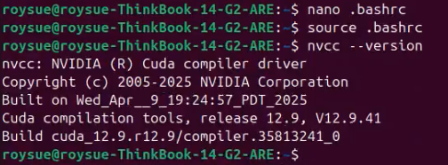

再安装系统推荐的虚拟环境工具：

```bash
$ sudo apt install -y python3-pip python3.12-venv
```

新建文件夹01，在文件夹中创建虚拟环境：

```bash
$ mkdir 01 && cd 01
$ python3 -m venv ./ 
```

此时在01文件夹中创建了与系统隔离的虚拟Python环境，使用虚拟环境中的pip来安装PyCUDA：

```bash
$ ./bin/pip install pycuda
```

此时打开htop可以看到编译的进程CPU占用100% 。

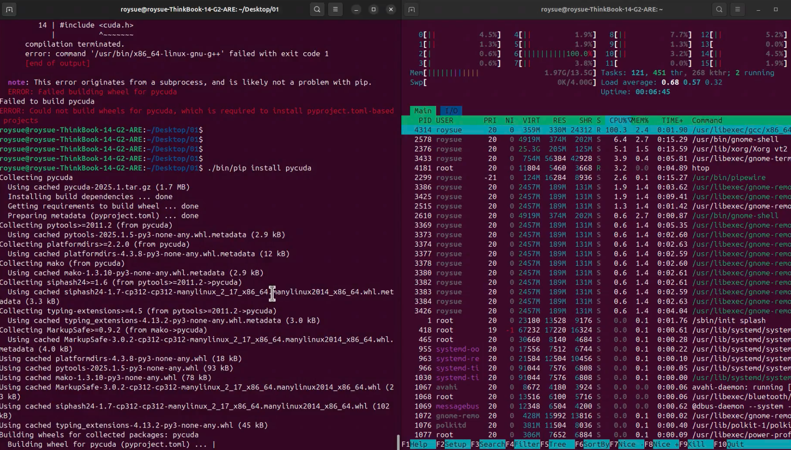

出现`Successfully Installed ...pycuda-2025.1...`即安装成功。

运行附件的`deviceQuery.py`脚本即可输出找到CUDA设备即PyCUDA安装运行成功。

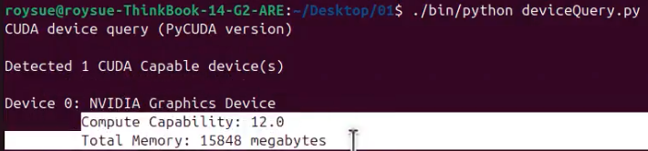

`Compute Capability`计算能力是英伟达显卡核心架构和硬件指令支持的一个重要指标，详细介绍地址：https://developer.nvidia.com/cuda-gpus

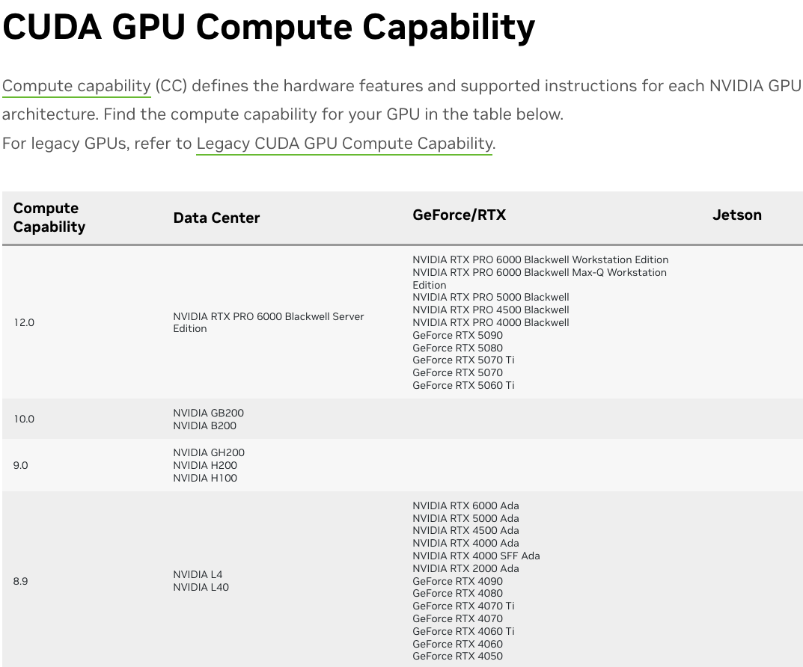

`12.0`正是代表`Blackwell`架构设备，比B200、H200、4090等几万几十万的显卡都要高。5060虽然只要不到四千块，架构是当下最新的，与其他型号贵价的产品只有性能的差异。

#### 1.3 小结

本文详细记录了在最新Ubuntu LTS系统上为RTX 5060 Ti显卡搭建PyCUDA开发环境的全过程。若未来读者拿到更新的显卡可以按照本文的方法搭建CUDA和Python开发环境。