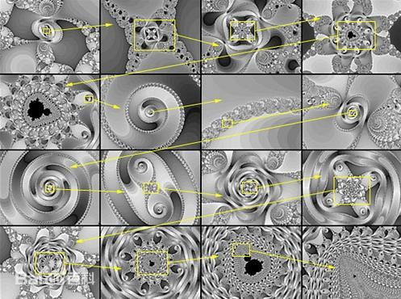
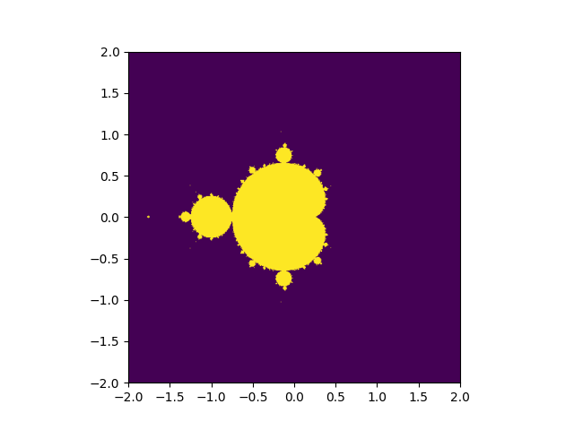
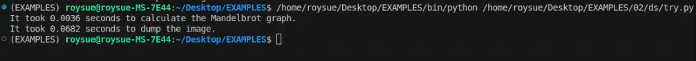

<!-- @import "[TOC]" {cmd="toc" depthFrom=1 depthTo=6 orderedList=false} -->

<!-- code_chunk_output -->

- [02.上帝之心算法用GPU计算快50倍](#02上帝之心算法用gpu计算快50倍)
  - [2.1 简单Python画曼德勃罗特集算法](#21-简单python画曼德勃罗特集算法)
    - [2.1.1 “上帝之心”的由来](#211-上帝之心的由来)
    - [2.2.2 简单py算法实现](#222-简单py算法实现)
  - [2.2 cProfile性能分析算法函数瓶颈](#22-cprofile性能分析算法函数瓶颈)
    - [2.2.1 函数粒度分析性能瓶颈](#221-函数粒度分析性能瓶颈)
    - [2.2.2 逐行耗时分析性能瓶颈](#222-逐行耗时分析性能瓶颈)
  - [2.3 PyCUDA之gpuarray显卡跑算法](#23-pycuda之gpuarray显卡跑算法)
    - [2.3.1 “Hello World”](#231-hello-world)
    - [2.3.2 GPU和CPU工作原理的差异](#232-gpu和cpu工作原理的差异)
  - [2.4 PyCUDA之内联CUDA C算法提速](#24-pycuda之内联cuda-c算法提速)
  - [2.5 纯GPU重构算法比CPU快五十倍](#25-纯gpu重构算法比cpu快五十倍)

<!-- /code_chunk_output -->

### 02.上帝之心算法用GPU计算快50倍

本文介绍了上帝之心的算法及其Python实现，使用Python语言的性能分析工具测算性能瓶颈，将算法最耗时的部分重构至CUDA C语言在纯GPU上运行，利用GPU核心更多并行更快的优势显著提高算法运算速度，实现了结果不变的情况下将耗时缩短五十倍的目标。

#### 2.1 简单Python画曼德勃罗特集算法

##### 2.1.1 “上帝之心”的由来

曼德勃罗特集是一个几何图形，曾被称为“上帝的指纹”。


只要计算的点足够多，不管把图案放大多少倍，都能显示出更加复杂的局部，这些局部既与整体不同，又有某种相似的地方。

图案具有无穷无尽的细节和自相似性。如图所示形产生过程，其中后一个图均是前一个图的某一局部放大：



>来源：百度百科

##### 2.2.2 简单py算法实现

跟任意GPT要一个简单Python实现的曼德勃罗特集算法，可以得到以下源码：

```py
def simple_mandelbrot(width, height, real_low, real_high, imag_low, imag_high, max_iters, upper_bound):
    real_vals = np.linspace(real_low, real_high, width)
    imag_vals = np.linspace(imag_low, imag_high, height)        
    mandelbrot_graph = np.ones((height, width), dtype=np.float32)    
    for x in range(width):
        for y in range(height):
            c = np.complex64(real_vals[x] + imag_vals[y] * 1j)
            z = np.complex64(0)            
            for i in range(max_iters):
                z = z ** 2 + c                
                if np.abs(z) > upper_bound:
                    mandelbrot_graph[y, x] = 0
                    break                
    return mandelbrot_graph
```

加上具体的图片大小，实部虚部，迭代次数，发散阈值，进行计算，并记录计算时间，且保存图像，记录保存时间。

```py
if __name__ == '__main__':
    t1 = time()
    mandel = simple_mandelbrot(512, 512, -2, 2, -2, 2, 256, 2.5)
    t2 = time()
    mandel_time = t2 - t1
    
    t1 = time()
    fig = plt.figure(1)
    plt.imshow(mandel, extent=(-2, 2, -2, 2))
    plt.savefig('mandelbrot.png', dpi=fig.dpi)
    t2 = time()
    
    dump_time = t2 - t1
    
    print('It took {} seconds to calculate the Mandelbrot graph.'.format(mandel_time))
    print('It took {} seconds to dump the image.'.format(dump_time))
```

在笔者的i5-13490F的CPU上，Python3.12.3版本，输出结果是：

```bash
~/Desktop/EXAMPLES/02$ ../bin/python mandelbrot.py 
It took 3.529670000076294 seconds to calculate the Mandelbrot graph.
It took 0.06651782989501953 seconds to dump the image.
```

计算过程耗时3.53秒，存成图片耗时0.067秒。图片如图：



#### 2.2 cProfile性能分析算法函数瓶颈  

##### 2.2.1 函数粒度分析性能瓶颈

Python 的 cProfile 模块是一个内置的性能分析工具（Profiler），用于统计代码中各个函数的执行时间、调用次数等详细信息，帮助开发者找出程序的性能瓶颈。

主要功能特点包括：

- 统计每个函数的调用次数和时间：记录函数的总执行时间（包括子函数调用）和单独执行时间（不包括子函数）。
- 生成性能报告：以表格形式输出结果，方便分析热点代码。
- 低开销：相比 profile 模块（纯 Python 实现），cProfile 是 C 语言实现的，对程序运行速度影响较小。

使用`-m`参数调用cProfile模块，按照累计运行时间降序排列`-s cumtime`，结果重定向至`mandelbrot_cProfile.txt`文件。

```bash
$ ../bin/python -m cProfile -s cumtime mandelbrot.py > mandelbrot_cProfile.txt
```

最终结果输出前20行可以得知，`mandelbrot.py:10(simple_mandelbrot)`就调用了1次，耗时4.016秒，为`tottime`指标最高的单一函数。

```bash
$ head -20  mandelbrot_cProfile.txt 
It took 4.01598596572876 seconds to calculate the Mandelbrot graph.
It took 0.10479903221130371 seconds to dump the image.
         1272295 function calls (1250243 primitive calls) in 4.610 seconds

   Ordered by: cumulative time

   ncalls  tottime  percall  cumtime  percall filename:lineno(function)
     65/2    0.000    0.000    4.503    2.252 text.py:926(get_window_extent)
    101/2    0.002    0.000    4.503    2.252 text.py:358(_get_layout)
        1    4.016    4.016    4.016    4.016 mandelbrot.py:10(simple_mandelbrot)
       32    0.001    0.000    0.632    0.020 __init__.py:1(<module>)
    349/7    0.001    0.000    0.424    0.061 <frozen importlib._bootstrap>:1349(_find_and_load)
    346/7    0.001    0.000    0.424    0.061 <frozen importlib._bootstrap>:1304(_find_and_load_unlocked)
    331/7    0.001    0.000    0.423    0.060 <frozen importlib._bootstrap>:911(_load_unlocked)
```

>PS：**tottime**（直接运行时间）表示函数本身运行的时间，不包括调用其他函数的时间，它是函数内部执行代码的时间总和，不考虑子函数的执行时间。而**cumtime**（累积运行时间）表示函数及其所有子函数运行的总时间，它包括函数本身的时间（tottime）加上所有被该函数调用的子函数的时间总和。

##### 2.2.2 逐行耗时分析性能瓶颈

`cProfile`模块最小粒度为函数，如果想逐行分析，可以使用`line_profiler`模块。

line_profiler 是一个第三方库，可以显示每行代码的执行时间、次数和耗时占比。

首先安装该模块：

```bash
$ ../bin/pip install line_profiler
Collecting line_profiler
  Downloading line_profiler-4.2.0-cp312-cp312-manylinux_2_17_x86_64.manylinux2014_x86_64.whl.metadata (34 kB)
Downloading line_profiler-4.2.0-cp312-cp312-manylinux_2_17_x86_64.manylinux2014_x86_64.whl (720 kB)
   ━━━━━━━━━━━━━━━━━━━━━━━━━━━━━━━━━━━━━━━━ 720.1/720.1 kB 3.9 MB/s eta 0:00:00
Installing collected packages: line_profiler
Successfully installed line_profiler-4.2.0
```

然后在需要分析的函数名称前加上`@profile`装饰器。

```py
@profile 
def simple_mandelbrot(width, height, real_low, real_high, imag_low, imag_high, max_iters, upper_bound):
    real_vals = np.linspace(real_low, real_high, width)
    imag_vals = np.linspace(imag_low, imag_high, height)
    ...
```

最后使用`kernprof`命令行工具运行脚本，-l 表示逐行分析，-v 表示运行后立即显示结果。

```bash
~/Desktop/EXAMPLES/02$ ../bin/kernprof -l -v mandelbrot.py 
It took 8.354495286941528 seconds to calculate the Mandelbrot graph.
It took 0.07214522361755371 seconds to dump the image.
Wrote profile results to mandelbrot.py.lprof
Timer unit: 1e-06 s

Total time: 6.02906 s
File: mandelbrot.py
Function: simple_mandelbrot at line 9

Line #      Hits         Time  Per Hit   % Time  Line Contents
==============================================================
     9                                           @profile 
    10                                           def simple_mandelbrot(width, height, real_low, real_high, imag_low, imag_high, max_iters, upper_bound):
    11         1         57.4     57.4      0.0      real_vals = np.linspace(real_low, real_high, width)
    12         1         16.5     16.5      0.0      imag_vals = np.linspace(imag_low, imag_high, height)
    13                                                   
    14                                               # we will represent members as 1, non-members as 0.
    15         1        274.7    274.7      0.0      mandelbrot_graph = np.ones((height, width), dtype=np.float32)
    16                                               
    17       513         53.5      0.1      0.0      for x in range(width):
    18    262656      28811.2      0.1      0.5          for y in range(height):
    19    262144     306395.3      1.2      5.1              c = np.complex64(real_vals[x] + imag_vals[y] * 1j)
    20    262144      75984.6      0.3      1.3              z = np.complex64(0)
    21                                                       
    22   7282380     791951.4      0.1     13.1              for i in range(max_iters):
    23   7257560    1193944.6      0.2     19.8                  z = z ** 2 + c
    24                                                           
    25   7257560    3568029.4      0.5     59.2                  if np.abs(z) > upper_bound:
    26    237324      40273.0      0.2      0.7                      mandelbrot_graph[y, x] = 0
    27    237324      23266.9      0.1      0.4                      break
    28                                                           
    29         1          1.0      1.0      0.0      return mandelbrot_graph

```

使用`line_profiler`模块会拖慢函数，从3秒慢到了8秒。运行结果是函数逐行的耗时，其中：
- Hits：该行执行次数
- Time：该行总耗时（微秒）
- % Time：该行占函数总耗时的百分比。

耗时最多的三行，功能分别是控制每个像素点的迭代次数（max_iters 次）、曼德勃罗集的迭代公式（复数运算）、和检查曼德勃罗集（Mandelbrot）的逃逸条件（判断复数 z 的模是否超过阈值 upper_bound），耗时多的原因是执行次数过多，各执行了7,257,560 次，每次都要运行复数平方运算（z ** 2）和复数的模（np.abs(z)）需要浮点计算。

```py
for i in range(max_iters):
  z = z ** 2 + c
  if np.abs(z) > upper_bound:
```

这三行代码的运算时间之和占整体的92.1%，如果优化这里可以显著降低算法运行时间，提高效率。

#### 2.3 PyCUDA之gpuarray显卡跑算法

##### 2.3.1 “Hello World”

跟任意GPT要个gpuarray的“Hello World”代码，可以得到类似如下代码。注释部分也是GPT添加的。

```py
import numpy as np
#自动内存管理：使用 pycuda.autoinit 自动管理CUDA上下文，简化了代码，适合简单的脚本。
import pycuda.autoinit
#PyCUDA 提供了类似 NumPy 的接口，使得在 GPU 上进行数组操作非常直观和方便。
from pycuda import gpuarray
#创建主机数组：使用 NumPy 创建一个数组 host_data，包含元素 [1, 2, 3, 4, 5]，数据类型为 float32。dtype=np.float32 确保数组的数据类型为单精度浮点数，这对于GPU计算很重要，因为 GPU 在处理浮点数时通常更高效。确保主机数组和GPU数组的数据类型一致（如 float32）可以避免潜在的错误和性能问题。
host_data = np.array([1,2,3,4,5] , dtype=np.float32)
#将主机数组传输到 GPU：使用 gpuarray.to_gpu() 方法将主机数组 host_data 传输到 GPU 上，并存储在 device_data 中。device_data 现在是一个GPU数组，存储在 GPU 的显存中。
device_data=gpuarray.to_gpu(host_data)
#在 GPU 上进行逐元素乘法操作：使用 2 * device_data 对 GPU 数组 device_data 中的每个元素乘以 2。这个操作在 GPU 上并行执行，速度比在 CPU 上逐元素操作快得多。结果存储在新的 GPU 数组 device_data_x2 中。
device_data_x2 = 2 * device_data
#将结果从 GPU 传输回主机，使用 .get() 方法将 GPU 数组 device_data_x2 中的数据传输回主机内存，并存储在 host_data_x2 中。host_data_x2 是一个 NumPy 数组，包含操作后的结果。
host_data_x2=device_data_x2.get()
print(host_data_x2)
```

运行一下，得到如下结果：
```bash
$ ../bin/python gpuarray.py 
[ 2.  4.  6.  8. 10.]
```

这是我们第一段在显卡上直接运行代码。

需要注意的是，向显卡发送数据时，需要通过NumPy显示声明数据类型。这样做的好处有两个：

1. 避免类型转换带来不必要的开销，消耗更多的计算时间或内存；
2. 后续会用CUDA C语言来内联编写代码，必须为变量声明规定具体的类型，否则C代码无法工作，毕竟C是编译型语言

##### 2.3.2 GPU和CPU工作原理的差异

前文的案例中，逐元素乘以常量的操作，是可以并行化运行的，因为一个元素的计算并不依赖其他任何元素的计算结果。

所以在gpuarray的线程上执行该操作时，PyCUDA可以将乘法操作转移至一个个单独的线程上，而不用像CPU一样一个接一个地串行计算。这也是GPU高吞吐的原因，CPU则是高性能。

- 可以将GPU类比于迅雷，每秒下载几兆的数据，倘若有延迟一两秒大家也不关心，大家更关心传输量大，此处“网很快、下载得快”的意思就是吞吐大，每秒多少兆。
- CPU类似于打网络游戏，延迟一般要求低于30ms，倘若延迟大于200ms网络游戏就几乎没有体验可言了，技能释放慢个几百毫秒结果就完全不同，但是丝毫不关心吞吐量，此处“网络很快”的意思就是延迟极低。

日常使用电脑的过程中，主要追求的也是低延迟。鼠标拖动的时候，肉眼不可以看到停顿，键盘按下去屏幕上立刻出现字符，桌面快捷方式双击后，程序窗口要立即出现，在程序之间切换要流畅自如毫无拖沓。

而什么场景需要显卡呢？典型场景，也是显卡迄今为止最为主要的工作内容，就是游戏画面渲染，一草一木、光影追踪，游戏两个最为核心的指标，画质和帧率，也就是渲染的画面的质量（像素点的多少）和每秒可以渲染多少张，此时评价显卡很快的意思就是，每秒出的图又细又多，也就是高吞吐。每秒出10张480p的图，相比每秒出100张1080p的图，玩的游戏体验不在一个次元上。

再来看一段GPU和CPU跑相同算法的速度对比。编写一段代码（time_calc.py），分别在CPU和GPU上运行同样的常量乘法计算，对比执行速度。

```py
import numpy as np
import pycuda.autoinit
from pycuda import gpuarray
from time import time
#创建五千万个随机单精度浮点数
host_data = np.float32(np.random.random(50000000))
#CPU计算耗时
t1 = time()
host_data_2x = host_data * np.float32(2)
t2 = time()
print('total time to compute on CPU: %f' % (t2 - t1))
#传输到显卡进行计算耗时
device_data = gpuarray.to_gpu(host_data)
t1 = time()
device_data_2x = device_data * np.float32(2)
t2 = time()
#数据从显卡传回主机
from_device = device_data_2x.get()
#比较 CPU 和 GPU 的计算结果是否相同
print('total time to compute on GPU: %f' % (t2 - t1))
print('Is the host computation the same as the GPU computation? : {}'.format(np.allclose(from_device, host_data_2x)))
```

在笔者机器i5-13490F、RTX5060ti 12G上运行三次，对比差异：

```bash
$ ../bin/python time_calc.py 
total time to compute on CPU: 0.043279
total time to compute on GPU: 0.058837
Is the host computation the same as the GPU computation? : True
$ ../bin/python time_calc.py 
total time to compute on CPU: 0.047776
total time to compute on GPU: 0.058785
Is the host computation the same as the GPU computation? : True
$ ../bin/python time_calc.py 
total time to compute on CPU: 0.046850
total time to compute on GPU: 0.057116
Is the host computation the same as the GPU computation? : True
```

可以发现CPU的速度几乎和GPU一样的快，这是什么原因呢？因为NumPy可以利用现代CPU中的SSE指令来加速计算，在某些场景中性能可以与GPU相媲美。

可以把浮点数的个数设置成五亿个：

```py
host_data = np.float32(np.random.random(500000000))
```

再运行三次对比差异：

```bash
$ ../bin/python time_calc.py 
total time to compute on CPU: 0.437335
total time to compute on GPU: 0.263772
Is the host computation the same as the GPU computation? : True
$ ../bin/python time_calc.py 
total time to compute on CPU: 0.436809
total time to compute on GPU: 0.056556
Is the host computation the same as the GPU computation? : True
$ ../bin/python time_calc.py 
total time to compute on CPU: 0.438307
total time to compute on GPU: 0.060931
Is the host computation the same as the GPU computation? : True
```

可以看到在第二次、第三次运行时，GPU的耗时约为CPU的十分之一，并行提速效果显著。可以推理得到倘若数据量更大会提速更多。

那为什么第一次GPU耗时偏多呢？因为PyCUDA编写的代码中的CUDA逻辑部分第一次运行时需要使用NVCC编译器编译成字节码，以供PyCUDA调用，所以第一次运行时间会长一些；后续再次调用时，如果代码没有修改，则直接使用已经编译好的缓存即可，这与我们玩一些3A大作的游戏，第一次运行需要进行“着色器编译”是相同的原理。

#### 2.4 PyCUDA之内联CUDA C算法提速

对gpuarray对象进行操作，默认会在纯GPU上执行，上一节对元素乘以2时，这个对象`2`会传输到GPU上，由GPU在显存中创建对象，在显卡的核心上并行计算。

如果操作涉及gpuarray与主机数据（或变量如numpy数组）的混合运算，PyCUDA会报错，因为它无法隐式决定数据位置。比如：

```py
# 会报错！不能直接混合gpuarray和CPU创建的numpy数组
device_data_2x = device_data * np.ones(100)
```

必须显式将数据放置在纯GPU（或纯CPU）上。那具体代码如何写呢？这里就可以引入`ElementwiseKernel`函数，直接内联CUDA C代码编程，追求最为设备原生的高性能。下面上案例（simple_element_kernel_example0.py）：

```py
import numpy as np
import pycuda.autoinit
from pycuda import gpuarray
from time import time
#用于创建元素级操作的CUDA内核
from pycuda.elementwise import ElementwiseKernel
host_data = np.float32(np.random.random(500000000))
# 定义一个CUDA元素级内核：输入参数：两个float指针(in和out)，操作：将输入数组的每个元素乘以2，结果存入输出数组，内核名称："gpu_2x_ker"
gpu_2x_ker = ElementwiseKernel(
    "float *in, float *out",
    "out[i] = 2*in[i];",
    "gpu_2x_ker"
)
def speedcomparison():
    t1 = time()
    host_data_2x = host_data * np.float32(2)
    t2 = time()
    print('total time to compute on CPU: %f' % (t2 - t1))
    device_data = gpuarray.to_gpu(host_data)
    # 在GPU上分配与输入数组大小相同的空输出数组
    device_data_2x = gpuarray.empty_like(device_data)
    t1 = time()
    # 调用之前定义的CUDA内核在GPU上执行计算
    gpu_2x_ker(device_data, device_data_2x)
    t2 = time()
    from_device = device_data_2x.get()
    print('total time to compute on GPU: %f' % (t2 - t1))
    print('Is the host computation the same as the GPU computation? : {}'.format(np.allclose(from_device, host_data_2x)))
if __name__ == '__main__':
    speedcomparison()
```

这样包括输入的所有参数、运算符和输出，都是在纯GPU的设备里操作，达到设备级别的原生高性能。同样多运行几次，观察速度差异：

```bash
$ ../bin/python simple_element_kernel_example0.py 
total time to compute on CPU: 0.431743
total time to compute on GPU: 0.565969
Is the host computation the same as the GPU computation? : True
$ ../bin/python simple_element_kernel_example0.py 
total time to compute on CPU: 0.436628
total time to compute on GPU: 0.062304
Is the host computation the same as the GPU computation? : True
$ ../bin/python simple_element_kernel_example0.py 
total time to compute on CPU: 0.433212
total time to compute on GPU: 0.055214
Is the host computation the same as the GPU computation? : True
```

同样可以观察到与前文一样的现象，首次运行CUDA C部分需要先用NVCC编译，再次运行速度才会获得显著提升。

>PS：思考：前文的混合运算这样写：device_data_2x = device_data * device_data，可以吗？答案是可以的，这表示两个GPU数组（gpuarray）之间的逐元素乘法，PyCUDA会将乘法运算符转成CUDA C的乘法，这个操作会完全在纯GPU上并行执行。

#### 2.5 纯GPU重构算法比CPU快五十倍

那最后的任务就是把耗时占92.1%的以下三行代码用`CUDA C`重写，使之充分利用显卡并行计算大吞吐的特性，进行充分的加速。

```py
for i in range(max_iters):
  z = z ** 2 + c
  if np.abs(z) > upper_bound:
```

算法开发和移植是当前工资最高的工作，可惜我不会，我只能问GPT。可悲的是，如果不会算法，连怎么调试，生成的结果对不对，模型有没有出现幻觉，都无法判断，毕竟在算法这个领域，GPT的能力大于自己。

幸亏我们的案例来自书籍，有作者调好的版本，同功能的`CUDA C`算法实现如下，可以说与Python的写法几乎一模一样：

```c
mandelbrot_graph[i] = 1;
pycuda::complex<float> c = lattice[i]; 
pycuda::complex<float> z(0,0);
for (int j = 0; j < max_iters; j++)
{
    z = z*z + c; 
    if(abs(z) > upper_bound)
    {
        mandelbrot_graph[i] = 0;
        break;
    }
}
```

同样算法的各种参数也需要改变：

```py
def gpu_mandelbrot(width, height, real_low, real_high, imag_low, imag_high, max_iters, upper_bound):
    # we set up our complex lattice as such
    real_vals = np.matrix(np.linspace(real_low, real_high, width), dtype=np.complex64)
    imag_vals = np.matrix(np.linspace(imag_high, imag_low, height), dtype=np.complex64) * 1j
    mandelbrot_lattice = np.array(real_vals + imag_vals.transpose(), dtype=np.complex64)    
    # copy complex lattice to the GPU
    #gpuarray.to_gpu函数只能处理NumPy的array类型，所以发送到GPU之前要进行包装；
    mandelbrot_lattice_gpu = gpuarray.to_gpu(mandelbrot_lattice)
    # allocate an empty array on the GPU
    #gpuarray.empty函数在GPU上分配内存，指定大小、形状及类型，可以看作是C语言中的malloc函数；比C的优点是不需要惦记内存释放或回收，因为gpuarray对象在析构时会自动清理。
    mandelbrot_graph_gpu = gpuarray.empty(shape=mandelbrot_lattice.shape, dtype=np.float32)
    #注意CUDA C里的模板类型pycuda：：complex和Python代码里的NumPy的Complex64是对应的，否则参数传递过去是无法解析的。比如CUDA C的int类型对应NumPy的int32类型，CUDA C的float类型对应NumPy的float32类型。另外，数组传递给CUDA C时，会被视为C指针。
    mandel_ker(mandelbrot_lattice_gpu, mandelbrot_graph_gpu, np.int32(max_iters), np.float32(upper_bound))              
    mandelbrot_graph = mandelbrot_graph_gpu.get()    
    return mandelbrot_graph
```

与原来的纯Python相比逻辑是一样的，只是多了各种数据格式的转换和映射，最后就是激动人心的测速环节，还是i5-13490F、RTX5060ti 12G的机器：

```bash
~/Desktop/EXAMPLES/02$ ../bin/python gpu_mandelbrot.py 
It took 0.1877138614654541 seconds to calculate the Mandelbrot graph.
It took 0.09330153465270996 seconds to dump the image.
~/Desktop/EXAMPLES/02$ ../bin/python gpu_mandelbrot.py 
It took 0.05863165855407715 seconds to calculate the Mandelbrot graph.
It took 0.07119488716125488 seconds to dump the image.
~/Desktop/EXAMPLES/02$ ../bin/python gpu_mandelbrot.py 
It took 0.062407732009887695 seconds to calculate the Mandelbrot graph.
It took 0.06969809532165527 seconds to dump the image.
```

同理第一次运行，是NVCC编译花了一些时间，后面稳定在0.06秒左右的水平，从3.53秒到0.06秒，大概是59倍的性能提升。

当然，需要对比确认下生成的PNG图片是一致的。本章节的任务成功完成。通过这个实验相信大家对GPU特性的理解可以说是非常深刻了。

PS：最后又让deepseek帮助优化了一下代码，执行ds优化后的版本，生成同样的图，速度降到了0.0036秒，是书中代码的1/20，可见，优化是深不见底的学问。



---

- 代码等附件下载地址：https://github.com/r0ysue/5060STUDY

---

引用来源：
- 《GPU编程实战（基于Python和CUDA）》、deepseek