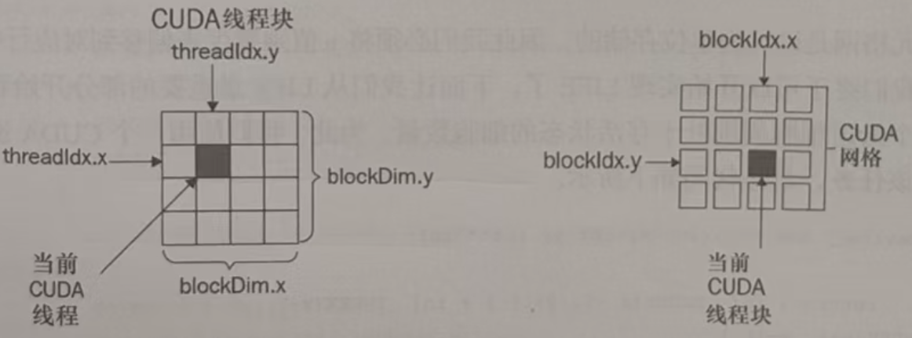
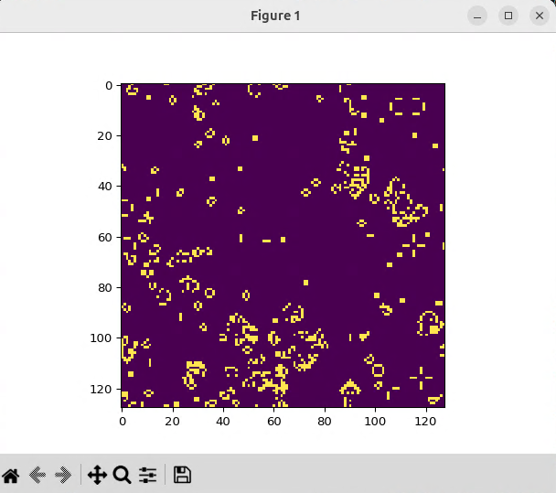
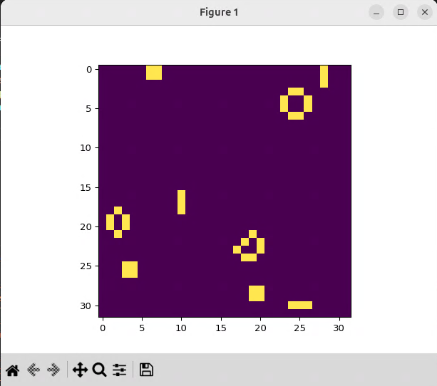
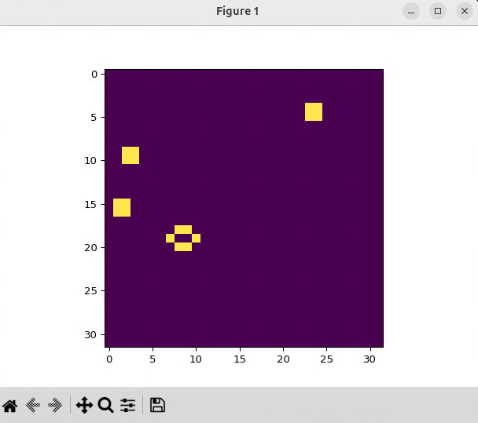
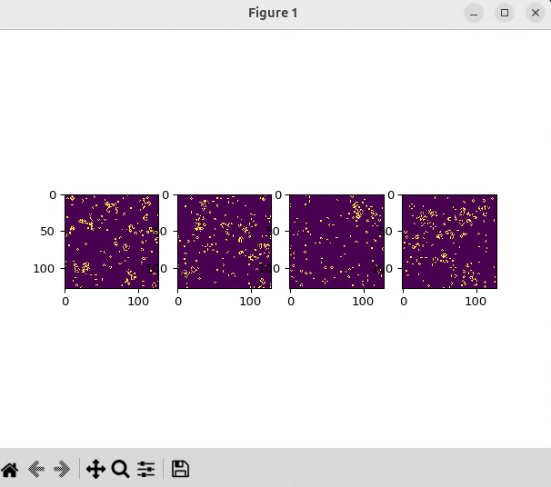

<!-- @import "[TOC]" {cmd="toc" depthFrom=1 depthTo=6 orderedList=false} -->

<!-- code_chunk_output -->

- [03.利用显卡内核模块等特性为算法提速百倍](#03利用显卡内核模块等特性为算法提速百倍)
  - [3.1 内核函数和设备函数](#31-内核函数和设备函数)
    - [3.1.1 SourceModule内核函数模块提速](#311-sourcemodule内核函数模块提速)
    - [3.1.2 SourceModule比ElementwiseKernel快多少？](#312-sourcemodule比elementwisekernel快多少)
    - [3.1.3 显卡的“网格-块-线程”三层计算网络模型](#313-显卡的网格-块-线程三层计算网络模型)
  - [3.2 线程同步和线程通信进一步提速](#32-线程同步和线程通信进一步提速)
    - [3.2.1 康威生命游戏算法案例学习网格计算模型](#321-康威生命游戏算法案例学习网格计算模型)
    - [3.2.2 线程同步函数__syncthreads](#322-线程同步函数__syncthreads)
    - [3.2.3 线程块内部共享内存加速](#323-线程块内部共享内存加速)
  - [3.3 并发CUDA流提升GPU利用效率](#33-并发cuda流提升gpu利用效率)
    - [3.3.1 并发CUDA流提升四倍效率](#331-并发cuda流提升四倍效率)
    - [3.3.2 CUDA流并发运行康威生命游戏](#332-cuda流并发运行康威生命游戏)
    - [3.3.3 事件Event精准测量CUDA流步骤耗时](#333-事件event精准测量cuda流步骤耗时)
    - [3.3.4 CUDA流中的设备同步和上下文](#334-cuda流中的设备同步和上下文)

<!-- /code_chunk_output -->


### 03.利用显卡内核模块等特性为算法提速百倍

本章中我们将学习到显卡的多种特性，如原生内核模块、“网格-块-线程”三层计算模型、线程同步和共享内存、CUDA流并发与事件管理等等概念，学习这些概念的目标是为了让算法在设计时充分利用这些特性，以达到十倍百倍降低成本、提高效率、提升速度的目的。

虽然这些都是极其枯燥的概念，但我们会尽量将概念糅合到代码里去，尽量从提升效率、提高速度的方向，去讲解利用好这些概念带来的实质提升效果，这样的理解最为深刻。

#### 3.1 内核函数和设备函数

上一章结尾deepseek给的代码速度比书本里的案例还要快20倍，以下为部分片段：

```py
# CUDA kernel for Mandelbrot set calculation
mandelbrot_kernel = """
__global__ void mandelbrot(float *output, 
                           float real_low, float real_high,
                           float imag_low, float imag_high,
                           int max_iters, float upper_bound,
                           int width, int height) {
    int x = blockIdx.x * blockDim.x + threadIdx.x;
    int y = blockIdx.y * blockDim.y + threadIdx.y;
    ...
}
"""

def gpu_mandelbrot(width, height, real_low, real_high, imag_low, imag_high, max_iters, upper_bound):
    # Compile the CUDA kernel
    mod = SourceModule(mandelbrot_kernel)
    mandelbrot_func = mod.get_function("mandelbrot")
    ...
    # Execute the kernel
    mandelbrot_func(output_gpu,
                   np.float32(real_low), np.float32(real_high),
                   np.float32(imag_low), np.float32(imag_high),
                   np.int32(max_iters), np.float32(upper_bound),
                   np.int32(width), np.int32(height),
                   block=block_size, grid=grid_size)

```

阅读源码可知它使用了如下PyCUDA的API：

- SourceModule
- get_function

还有，在其CUDA C实现中，没有任何库引入的情况下，直接使用`blockIdx.x * blockDim.x + threadIdx.x`和`blockIdx.y * blockDim.y + threadIdx.y`，这些`threadIdx`和`blockIdx`又是什么？接下来为您揭晓。

##### 3.1.1 SourceModule内核函数模块提速

SourceModule是PyCUDA的核心类之一，用于直接编译和加载CUDA C/C++代码到GPU上执行。它可以实现：

- 编写原生的 CUDA 内核（__global__ 函数）
- 使用 CUDA 的所有特性（如共享内存、原子操作、纹理内存等）
- 动态编译代码并生成 Python 可调用的 GPU 函数

跟ds要个HelloWorld：

```py
import pycuda.autoinit
from pycuda.compiler import SourceModule

# 编写 CUDA C 代码
kernel_code = """
__global__ void add(float *a, float *b, float *c) {
    int idx = threadIdx.x;
    c[idx] = a[idx] + b[idx];
}
"""

# 编译代码
mod = SourceModule(kernel_code)
add_func = mod.get_function("add")  # 获取内核函数
```

相比于之前学习的ElementwiseKernel，则是PyCUDA提供的一个高阶封装工具，用于快速创建简单的逐元素（element-wise）操作内核这样的特定场景。它可以自动生成内核代码，而无需手动写 CUDA C，比较适合简单的并行操作（如数组相加、乘法等），它在性能上是有一定限制，速度不如SourceModule。

二者对比：

|特性|SourceModule|ElementwiseKernel|
|:-|:-|:-|
|代码复杂度|需手动编写 CUDA C 代码|自动生成内核，只需写表达式|
|灵活性	|高（支持所有 CUDA 特性）|低（仅限逐元素操作）|
|性能|	更高（可手动优化）|较低（通用性导致额外开销）|
|适用场景|复杂算法（如前缀和、矩阵乘法、FFT等）|简单操作（如数组加减、逐点函数应用）|
|共享内存/同步支持|支持|不支持|

SourceModule通常更快的原因如下：

- 更底层的控制：可以手动优化内存访问（如使用共享内存、合并内存访问），支持线程同步（__syncthreads()），适合需要协作的算法。
- 避免抽象开销：ElementwiseKernel 需要解析字符串表达式并生成 CUDA 代码，引入额外开销。SourceModule 直接编译原生代码，无中间层。
- 适用复杂逻辑：例如前缀和算法需要多阶段计算，ElementwiseKernel无法实现。

那么何时可以选择ElementwiseKernel呢？在一些简单操作：如 a[i] = b[i] + c[i] * 2时可以的，或者快速原型开发，且不想写 CUDA C 代码的时候，并且ElementwiseKernel的代码更接近Python风格，可读性较好。

##### 3.1.2 SourceModule比ElementwiseKernel快多少？

同样跟deepseek要一段对比测速代码`simple_kernel_speed_compare.py`：

```py
import time
from pycuda import gpuarray
import pycuda.autoinit
from pycuda.compiler import SourceModule
import numpy as np
from pycuda.elementwise import ElementwiseKernel

# 查询设备最大线程数，这是显卡硬件限制，单block最大多少线程
from pycuda.driver import Device
max_threads = Device(0).max_threads_per_block
print(f"Max threads per block: {max_threads}")

# 设置合理的block尺寸（通常256或512是安全值）
block_size = 256

# 生成数据
N = 10000000
a = np.random.randn(N).astype(np.float32)
b = np.random.randn(N).astype(np.float32)
a_gpu = gpuarray.to_gpu(a)
b_gpu = gpuarray.to_gpu(b)
c_gpu = gpuarray.empty_like(a_gpu)

# 同样逻辑的算法实现
mod = SourceModule("""
    __global__ void add(float *a, float *b, float *c) {
        int idx = threadIdx.x;
        c[idx] = a[idx] + b[idx];
    }
""")
add_func = mod.get_function("add")

add_kernel = ElementwiseKernel(
    "float *a, float *b, float *c",
    "c[i] = a[i] + b[i]",
    "add_kernel"
)

# 测试 SourceModule
grid_size = (N + block_size - 1) // block_size
start = time.time()
add_func(a_gpu, b_gpu, c_gpu, block=(block_size, 1, 1), grid=(grid_size, 1, 1))
print("SourceModule Time:", time.time() - start)

# 测试 ElementwiseKernel
start = time.time()
add_kernel(a_gpu, b_gpu, c_gpu)
print("ElementwiseKernel Time:", time.time() - start)
```

第一次运行编译耗时增加，第二次开始耗时稳定。

```bash
$ /home/roysue/Desktop/EXAMPLES/bin/python /home/roysue/Desktop/EXAMPLES/03/simple_kernel_speed_compare.py
Max threads per block: 1024
SourceModule Time: 0.0009343624114990234
ElementwiseKernel Time: 0.16331028938293457

$ /home/roysue/Desktop/EXAMPLES/bin/python /home/roysue/Desktop/EXAMPLES/03/simple_kernel_speed_compare.py
Max threads per block: 1024
SourceModule Time: 0.00021767616271972656
ElementwiseKernel Time: 0.060277462005615234

$ /home/roysue/Desktop/EXAMPLES/bin/python /home/roysue/Desktop/EXAMPLES/03/simple_kernel_speed_compare.py
Max threads per block: 1024
SourceModule Time: 0.0001995563507080078
ElementwiseKernel Time: 0.05784893035888672
```

从耗时来看SourceModule比ElementwiseKernel大概快到两百多倍。

##### 3.1.3 显卡的“网格-块-线程”三层计算网络模型

从上一节的源码来看，`ElementwiseKernel`的计算子是`i`，而`SourceModule`的计算子是`threadIdx.x`，从表面上看这是二者的主要区别：

- threadIdx是CUDA的核心概念，表示当前线程在block中的x维度的索引，在直接使用SourceModule编写的内核函数中，需要手动计算全局索引。
- i这是ElementwiseKernel自动提供的索引变量，ElementwiseKernel是一个抽象的高级封装，会自动处理索引计算和网格配置，它会自动为每个元素分配一个唯一的全局索引i，相当于自动计算了threadIdx.x，使用起来更简单，但效率较低

这里引入了新的概念，也就是threadIdx。在 CUDA 编程中，gridDim、blockIdx、blockDim 和 threadIdx 是用于管理 GPU 线程层次结构的关键变量，它们决定了每个线程在计算网格中的位置。理解这些概念对于编写高效的 CUDA内核函数至关重要。

GPU 的并行计算模型采用“网格（Grid）—块（Block）—线程（Thread）”的三层结构：

- Grid（网格）：最外层结构，由多个 Block 组成
- Block（块）：每个 Block 包含多个 Thread（线程）
- Thread（线程）：最基本的执行单元，每个线程执行相同的核函数代码，但处理不同的数据

三层结构示意图：

```bash
Grid
├── Block 0 (thread 0, thread 1, ..., thread N)
├── Block 1 (thread 0, thread 1, ..., thread N)
...
└── Block M (thread 0, thread 1, ..., thread N)
```

体现在代码上，CUDA提供的线程索引相关的内置变量是：

- gridDim（Grid 的维度，即每个 Grid 的 Block 数）
- blockIdx（Block 在 Grid 中的索引）
- blockDim（Block 的维度，即每个 Block 的线程数）
- threadIdx（线程在 Block 内的局部索引）

正因为是内置变量，所以不需要显示地导入库即可直接使用，这也正好回答了前文的疑问。

CUDA还提供了以下内置变量来标识线程的位置：

1.threadIdx.x, threadIdx.y, threadIdx.z

表示当前线程在其所属 Block 中的 局部索引（0 开始）。可以是 1D、2D 或 3D 结构（取决于 Block 的定义方式）。例如：
- threadIdx.x：线程在 Block 的 x 方向上的索引。
- threadIdx.y：线程在 Block 的 y 方向上的索引（2D Block 时使用）。
- threadIdx.z：线程在 Block 的 z 方向上的索引（3D Block 时使用）。

2.blockDim.x, blockDim.y, blockDim.z

表示 Block 的维度（即每个 Block 有多少个线程）。blockDim.x 表示 Block 在 x 方向的线程数。例如：
- blockDim.x = 256 表示 Block 在 x 方向有 256 个线程。

>每个block最多有1024个thread

3.blockIdx.x, blockIdx.y, blockIdx.z

表示当前 Block 在整个 Grid 中的 索引（0 开始）。例如：
- blockIdx.x = 0 表示第一个 Block。
- blockIdx.x = 1 表示第二个 Block，依此类推。

同样前文代码中，`add_func(a_gpu, b_gpu, c_gpu, block=(block_size, 1, 1), grid=(grid_size, 1, 1))`函数在传入前三个参数后，还额外传入了`block`和`grid`的位置，并且`block_size`和`grid_size`还根据设备信息做了大小计算，目的是防止越界；而`add_kernel(a_gpu, b_gpu, c_gpu)`函数则不需要。这也正好体现了`SourceModule`需要手动管理`block`和`grid`的位置，而`ElementwiseKernel`则是自动管理的。

由此可知，越到底层，开销越低，速度越快，管理越复杂和精细化。

#### 3.2 线程同步和线程通信进一步提速

在编写算法时，如果把计算放在单个block内完成，可以使用block内的线程同步和线程通信机制即共享内存，来进一步给算法提速。

同样还是通过案例来学习这些概念，有个非常贴切的算法正好贴合“网格（Grid）—块（Block）—线程（Thread）”三层计算网格概念的学习，那就是康威生命游戏算法（conway live game）。

##### 3.2.1 康威生命游戏算法案例学习网格计算模型

首先介绍康威生命游戏的概念：https://lg.dtsci.cn

康威生命游戏（Conway's Game of Life），又称康威生命棋，是英国数学家约翰·何顿·康威在1970年发明的细胞自动机。

游戏规则：生命游戏中，对于任意细胞，规则如下：

- 每个细胞有两种状态 - 存活或死亡，每个细胞与以自身为中心的周围八格细胞产生互动（彩色为存活，灰色为死亡）
- 当前细胞为存活状态时，当周围的存活细胞低于2个时（不包含2个），该细胞变成死亡状态。（模拟生命数量稀少）
- 当前细胞为存活状态时，当周围有2个或3个存活细胞时，该细胞保持原样
- 当前细胞为存活状态时，当周围有超过3个存活细胞时，该细胞变成死亡状态。（模拟生命数量过多）
- 当前细胞为死亡状态时，当周围有3个存活细胞时，该细胞变成存活状态。（模拟繁殖）

这种模型是图灵完备的，也就是说，理论上生命游戏的规则可以实现计算机能够实现的全部功能。例如，可以在生命游戏中模拟运行另外一个生命游戏。

可以从书中获得案例代码，让deepseek进行详细的注释讲解：

- 导入模块

```python
import pycuda.autoinit  # 自动初始化CUDA环境
import pycuda.driver as drv  # CUDA驱动接口
from pycuda import gpuarray  # GPU数组操作
from pycuda.compiler import SourceModule  # CUDA内核编译
import numpy as np  # 数值计算
import matplotlib.pyplot as plt  # 绘图
import matplotlib.animation as animation  # 动画
```

接下来是CUDA C编写的核心计算逻辑：

- 宏定义计算当前线程处理的全局x,y坐标。
```c
#define _X  ( threadIdx.x + blockIdx.x * blockDim.x )
#define _Y  ( threadIdx.y + blockIdx.y * blockDim.y )
```

_X和_Y坐标是如何计算出来的？blockIdx.x表示当前Block在整个Grid中的索引（0开始），blockDim.x表示Block的维度（即每个Block有多少个线程），二者相乘即确定当前block的第0个线程的坐标线程初始值，加上threadIdx.x偏移即可唯一确定X轴的threadIdx坐标；Y轴同理。



>为什么不在单个block内运行线程？因为单个block内最多只有1024个线程，也就是最大32*32的网格，这样的网格太小了。

- 计算整个网格的宽度和高度。

```c
#define _WIDTH  ( blockDim.x * gridDim.x )
#define _HEIGHT ( blockDim.y * gridDim.y  )
```

- 实现环形边界条件（toroidal边界），超出边界的坐标会绕到另一侧。

```c
#define _XM(x)  ( (x + _WIDTH) % _WIDTH )
#define _YM(y)  ( (y + _HEIGHT) % _HEIGHT )
```

- 将2D坐标转换为1D数组索引。


```c
#define _INDEX(x,y)  ( _XM(x)  + _YM(y) * _WIDTH )
```

- 邻居计数函数，用来计算一个细胞周围8个邻居中存活细胞的数量。

```c
__device__ int nbrs(int x, int y, int * in)
{
     return ( in[ _INDEX(x -1, y+1) ] + in[ _INDEX(x-1, y) ] + in[ _INDEX(x-1, y-1) ] \
                   + in[ _INDEX(x, y+1)] + in[_INDEX(x, y - 1)] \
                   + in[ _INDEX(x+1, y+1) ] + in[ _INDEX(x+1, y) ] + in[ _INDEX(x+1, y-1) ] );
}
```
>该函数为设备函数，是一个用C语言编写的以串行方式运行的函数，可以被内核函数中的单个线程调用，也就是说该函数会被多个线程同时并行调用。

- 主内核函数，用来实现生命游戏的规则，即存活细胞：只有2或3个邻居时存活，否则死亡；死亡细胞：恰好3个邻居时复活

```c
__global__ void conway_ker(int * lattice_out, int * lattice)
{
   int x = _X, y = _Y;
   int n = nbrs(x, y, lattice);
   
   if ( lattice[_INDEX(x,y)] == 1)
       switch(n)
       {
          case 2:
          case 3: lattice_out[_INDEX(x,y)] = 1; break;
          default: lattice_out[_INDEX(x,y)] = 0;                   
       }
   else if( lattice[_INDEX(x,y)] == 0 )
         switch(n)
         {
            case 3: lattice_out[_INDEX(x,y)] = 1; break;
            default: lattice_out[_INDEX(x,y)] = 0;         
         }
}
```

最后是python主程序部分：

- 内核函数获取

```python
conway_ker = ker.get_function("conway_ker")
```

- 调用CUDA内核计算下一代存活状态，更新图像数据，将新状态复制到当前状态

```python
def update_gpu(frameNum, img, newLattice_gpu, lattice_gpu, N):
    conway_ker(newLattice_gpu, lattice_gpu, grid=(N//32, N//32, 1), block=(32, 32, 1))
    img.set_data(newLattice_gpu.get())
    lattice_gpu[:] = newLattice_gpu[:]
    return img
```

- 最后是主程序

```python
if __name__ == '__main__':
    N = 128  # 网格大小
    # 初始化随机网格（25%存活）
    lattice = np.int32(np.random.choice([1,0], N*N, p=[0.25, 0.75]).reshape(N, N))
    lattice_gpu = gpuarray.to_gpu(lattice)  # 上传到GPU
    newLattice_gpu = gpuarray.empty_like(lattice_gpu)  # 输出缓冲区
    
    # 设置动画
    fig, ax = plt.subplots()
    img = ax.imshow(lattice_gpu.get(), interpolation='nearest')
    ani = animation.FuncAnimation(
        fig,                # 绘图画布
        update_gpu,         # 更新函数
        fargs=(img, newLattice_gpu, lattice_gpu, N),  # 传给更新函数的额外参数
        interval=0,         # 帧间隔时间(ms)
        frames=1000,        # 总帧数
        save_count=1000     # 动画缓存帧数
    )
    plt.show()
```

- 关键点总结：
1.GPU并行化：每个CUDA线程处理一个细胞的状态计算
2.环形边界：通过模运算实现无限扩展的网格
3.双缓冲技术：使用两个数组避免读写冲突
4.高效内存访问：使用宏定义优化坐标计算
5.可视化：通过matplotlib实时显示演化过程

这种实现方式充分利用了GPU的并行计算能力，可以高效处理大规模的生命游戏模拟。

在正式运行之前可能需要安装一下图形库：

```bash
$ sudo apt-get install python3-tk
```

最终运行效果与网页类似：

```bash
~/Desktop/EXAMPLES$ ./bin/python 03/conway_gpu.py 
```



##### 3.2.2 线程同步函数__syncthreads

上一节的代码中中，
```py
conway_ker = ker.get_function("conway_ker")
def update_gpu(frameNum, img, newLattice_gpu, lattice_gpu, N):    
    conway_ker(newLattice_gpu, lattice_gpu, grid=(N//32, N//32, 1), block=(32, 32, 1))
```

每一次刷新帧均由Python程序发起，迭代一千次，发起一次，单元网格迭代一次，不会有线程同步的问题。

```py
    ani = animation.FuncAnimation(
        fig,                # 绘图画布
        update_gpu,         # 更新函数
        fargs=(img, newLattice_gpu, lattice_gpu, N),  # 传给更新函数的额外参数
        interval=0,         # 帧间隔时间(ms)
        frames=1000,        # 总帧数
        save_count=1000     # 动画缓存帧数
    )
```

如果迭代是在纯GPU上进行，即每个线程单独迭代一千次，则会出现快慢的问题；如果是写的for循环i参数来迭代的话，还会引起条件竞争的问题，即多个线程读写一个i的地址，造成线程状态不可知的问题。

这时候就需要线程同步函数__syncthreads，该函数的功能是使线程块内的所有线程在执行到__syncthreads函数时都会暂停，等待同一线程块中的所有线程执行到同一调用，线程才会继续执行后面的代码。__syncthreads函数的作用范围是同一线程块block内，而不是grid网格里的所有block。

那接下来更新代码，上一节N=128，grid=(N//32, N//32, 1)即grid=(4, 4, 1)，有16个block；这次__syncthreads作用域仅在单个block内，那么grid只能是（1,1,1）。

```py
# 执行内核，1个网格块，32x32线程块，1000万次迭代
    conway_ker(lattice_gpu, np.int32(10000000), grid=(1,1,1), block=(32,32,1))
```

主内核函数：

```c
__global__ void conway_ker(int * lattice, int iters)
{
   int x = _X, y = _Y;   
   for (int i = 0; i < iters; i++)
   {
       int n = nbrs(x, y, lattice);       
       int cell_value;                       
        if ( lattice[_INDEX(x,y)] == 1)
           switch(n)
           {
              case 2:
              case 3: cell_value = 1;
                      break;
              default: cell_value = 0;                   
           }
        else if( lattice[_INDEX(x,y)] == 0 )
             switch(n)
             {
                case 3: cell_value = 1;
                        break;
                default: cell_value = 0;         
             }             
        __syncthreads();
        lattice[_INDEX(x,y)] = cell_value;
        __syncthreads(); 
    }
}
```

- 每个线程处理一个细胞
- 迭代iters次，每次迭代：
1.计算当前细胞的存活邻居数
2.根据游戏规则决定细胞下一状态：活细胞：2或3个邻居时存活，否则死亡；死细胞：恰好3个邻居时复活
3.使用__syncthreads()同步线程
4.更新细胞状态

运行即可得到迭代1000万次后的结果，由于初始状态是随机的，所以结束状态也是每次运行各不相同，类似如下：



可以看到网格小了许多，线程只有32x32个。前文的图是128x128个。

##### 3.2.3 线程块内部共享内存加速

上一节的代码中，内核函数中的线程使用的数组位于GPU的全局内存中。可以进一步使用线程块内部的共享内存，进一步提高运行速度。

该共享内存的作用域在block之内，所以不能被其他block所访问。想要被其他block访问的话，得先复制到GPU全局内存中才可以。以下为详细案例：

```c
__global__ void conway_ker_shared(int * p_lattice, int iters)
{
   // x, y are the appropriate values for the cell covered by this thread
   int x = _X, y = _Y;
   //声明使用共享内存的数组lattice
   __shared__ int lattice[32*32];
   //将外部gpuarray复制到GPU全局内存的数组拷贝到block内的共享内存
   lattice[_INDEX(x,y)] = p_lattice[_INDEX(x,y)];
   __syncthreads();
   for (int i = 0; i < iters; i++)
   {
       // Count the number of neighbors around the current cell
       //以下均为使用共享内存进行运算
       int n = nbrs(x, y, lattice);       
       int cell_value;                       
        // If the current cell is alive, determine if it lives or dies
        if (lattice[_INDEX(x,y)] == 1)
           switch(n)
           {
              case 2:
              case 3: cell_value = 1;
                      break;
              default: cell_value = 0;                   
           }
        else if (lattice[_INDEX(x,y)] == 0)
             switch(n)
             {
                case 3: cell_value = 1;
                        break;
                default: cell_value = 0;         
             }             
        __syncthreads();
        lattice[_INDEX(x,y)] = cell_value;
        __syncthreads();
    }             
    __syncthreads();
    //将计算结果拷贝回GPU全局内存，方便后续gpuarray取出回电脑主机
    p_lattice[_INDEX(x,y)] = lattice[_INDEX(x,y)];
    __syncthreads();
}
""")
```

运行起来的效果与上一节类似，运行速度有显著提升：



#### 3.3 并发CUDA流提升GPU利用效率

前面我们写代码实现了一个康威生命游戏的实例，网格里闪烁的生命非常耀眼。如果我要实现2个实例、4个、8个、16个甚至无限个实例呢？GPU是吞吐机，但凡用到GPU的场景，都会倾向于更高的并发。并发越多，其相对于CPU的优势就越大，利用效率就越高。

实现多个康威生命游戏的实例，每一个实例可以叫做一个CUDA流。CUDA流（Stream）是CUDA编程中用于管理并发执行任务的重要概念，它允许在GPU上并行组织多个操作（如内核执行、内存传输等）。

在CUDA流的基础上，就有了事件（Events）、上下文（Context）、同步（Synchronization）等等概念，接下来在案例中学习。

##### 3.3.1 并发CUDA流提升四倍效率

先看代码`multi-kernel.py`：

- 定义 CUDA 内核函数：

```python
ker = SourceModule("""       
__global__ void mult_ker(float * array, int array_len)
{
     int thd = blockIdx.x*blockDim.x + threadIdx.x;
     int num_iters = array_len / blockDim.x;

     for(int j=0; j < num_iters; j++)
     {
         int i = j * blockDim.x + thd;

         for(int k = 0; k < 50; k++)
         {
              array[i] *= 2.0;
              array[i] /= 2.0;
         }
     }
}
""")
```
1.__global__ 表示这是一个 CUDA 内核函数，可以从主机调用在设备上执行
2.函数参数：float * array (数组指针) 和 int array_len (数组长度)
3.thd 计算当前线程的全局索引
4.num_iters 计算每个线程需要处理的元素数量
5.内部循环执行 50 次乘 2.0 和除 2.0 操作（实际上不改变数值，仅用于模拟计算负载，不会有上下结果依赖，完全可以并发执行）

- 准备测试数据

```python
num_arrays = 200  # 数组数量
array_len = 1024**2  # 每个数组长度 (1M 元素)

data = []
data_gpu = []
gpu_out = []

# 生成随机数组
for _ in range(num_arrays):
    data.append(np.random.randn(array_len).astype('float32'))
```

- 执行计算并计时

```python
t_start = time()

# 将数组复制到 GPU
for k in range(num_arrays):
    data_gpu.append(gpuarray.to_gpu(data[k]))

# 处理数组 (调用内核函数)
for k in range(num_arrays):
    mult_ker(data_gpu[k], np.int32(array_len), block=(64,1,1), grid=(1,1,1))

# 将结果从 GPU 复制回主机
for k in range(num_arrays):
    gpu_out.append(data_gpu[k].get())

t_end = time()
block=(64,1,1) 定义线程块大小为 64 个线程
grid=(1,1,1) 定义网格大小为 1 个线程块
```

- 验证结果并输出时间

```python
# 验证结果是否正确 (应与原始数据相同)
for k in range(num_arrays):
    assert (np.allclose(gpu_out[k], data[k]))

print('Total time: %f' % (t_end - t_start))
```

运行一下可以得到耗时：

```bash
~/Desktop/EXAMPLES$ ./bin/python 03/multi-kernel.py 
Total time: 1.933080
```

那现在引入CUDA流且引入流的并行运行的概念，创建多个CUDA流(Stream)，每个数组对应一个独立的流。

```python
streams = []
for _ in range(num_arrays):
    streams.append(drv.Stream())
```

使用`to_gpu_async`替代`to_gpu`实现异步数据传输，指定了对应的流，数据传输可以在该流中异步执行：

```python
#原始同步版本
data_gpu.append(gpuarray.to_gpu(data[k]))
#优化后的异步版本
data_gpu.append(gpuarray.to_gpu_async(data[k], stream=streams[k]))
```

异步内核执行，内核调用时指定了对应的流，使内核执行可以异步进行：

```python
# 原始同步版本
mult_ker(data_gpu[k], np.int32(array_len), block=(64,1,1), grid=(1,1,1))
# 优化后的异步版本
mult_ker(data_gpu[k], np.int32(array_len), block=(64,1,1), grid=(1,1,1), stream=streams[k])
```

异步数据回传，使用 get_async 替代 get 实现异步数据回传：
```python
# 原始同步版本
gpu_out.append(data_gpu[k].get())
# 优化后的异步版本
gpu_out.append(data_gpu[k].get_async(stream=streams[k]))
```

这些优化带来了以下性能改进：

- 数据传输与计算重叠：不同流中的数据传输和内核执行可以并行进行;当GPU正在处理一个流中的计算时，可以同时进行另一个流的数据传输
- 减少CPU等待时间：异步操作允许CPU在发起GPU操作后继续执行，而不是等待每个操作完成
- 更好的GPU利用率：多个流中的操作可以更充分地利用GPU的计算和内存带宽资源

运行优化后的脚本multi-kernel_streams.py：

```bash
$ ./bin/python 03/multi-kernel_streams.py
Total time: 0.431015
```

可见速度优化至原来的四分之一。

##### 3.3.2 CUDA流并发运行康威生命游戏

这一节我们用CUDA流来并发运行四个康威生命游戏。

创建4条CUDA流放进数组里，每个流相当于一个独立的任务队列，可并行异步重叠执行计算和内存操操作：

```python
num_concurrent = 4
streams = []
for k in range(num_concurrent):
    streams.append(drv.Stream())  # 创建独立CUDA流
```

不同流的kernel也可以并发执行：

```python
conway_ker(newLattices_gpu[k], lattices_gpu[k], 
           grid=(N//32, N//32, 1), 
           block=(32, 32, 1), 
           stream=streams[k])  # 显式指定执行的流
```

异步数据下载，异步的get_async()替代同步的get()，把异步下载操作绑定到到特定流，不阻塞其他流：

```python
imgs[k].set_data(newLattices_gpu[k].get_async(stream=streams[k]))
```

异步数据更新，显卡内内存复制也实现异步化：

```py
lattices_gpu[k].set_async(newLattices_gpu[k], stream=streams[k])
```

数据结构重构，每个实例拥有独立内存空间，避免并发访问冲突：

```python
lattices_gpu = []  # 改为列表存储多个GPU数组
for k in range(num_concurrent):
    lattices_gpu.append(gpuarray.to_gpu(lattice))
```

可视化并行，多子图同时渲染不同模拟状态，各子图更新互不阻塞：

```python
fig, ax = plt.subplots(nrows=1, ncols=num_concurrent)
for k in range(num_concurrent):
    imgs.append(ax[k].imshow(..., interpolation='nearest'))
```

实际运行`conway_gpu_streams.py`下来，可以得到这样的效果：



可以尝试把`num_concurrent = 4`改成8、16、20、22、100、200等等数字，然后运行后，用`watch -d -n 1 nvidia-smi`查看负载，可以看到负载并没有显著提升，可见代码优化得效率很高。

##### 3.3.3 事件Event精准测量CUDA流步骤耗时

前文学习Python函数测量耗时用的cProfile模块，现在CUDA内核执行在GPU上，测速肯定得用GPU上的函数才能测量准确，这个机制就是Event事件机制。

还是直接用案例`simple_event_example.py`来学习，速度最快。这段代码演示了如何使用PyCUDA在GPU上执行并行计算，并测量内核执行时间。

- CUDA内核定义，这部分是CUDA内核代码，使用C语言语法编写：
1.__global__ 表示这是一个可以在GPU上执行的核函数
2.函数接收一个浮点数组指针和数组长度
3.thd 计算当前线程的全局索引
4.num_iters 计算每个线程需要处理的元素数量
5.外层循环让每个线程处理多个数组元素
6.内层循环对每个元素执行50次乘2和除2操作（这实际上是一个空操作，等于啥也没干，仅用于增加计算量，增加显卡负载）

```python
ker = SourceModule("""       
__global__ void mult_ker(float * array, int array_len)
{
     int thd = blockIdx.x*blockDim.x + threadIdx.x;
     int num_iters = array_len / blockDim.x;

     for(int j=0; j < num_iters; j++)
     {
         int i = j * blockDim.x + thd;

         for(int k = 0; k < 50; k++)
         {
              array[i] *= 2.0;
              array[i] /= 2.0;
         }
     }
}
""")
```

- 获取内核函数引用，从编译后的模块中获取名为'mult_ker'的内核函数引用

```python
mult_ker = ker.get_function('mult_ker')
```

- 准备数据

```python
array_len = 100*1024**2  # 数组长度：100MB (100×1024×1024个float32元素)

data = np.random.randn(array_len).astype('float32')  # 生成随机数据
data_gpu = gpuarray.to_gpu(data)  # 将数据传输到GPU
```

- 创建CUDA事件用于计时

```python
#CUDA事件用于精确测量GPU上的操作时间
start_event = drv.Event()
end_event = drv.Event()
```

- 执行内核并记录时间

```python
start_event.record()  # 记录开始时间点
mult_ker(data_gpu, np.int32(array_len), block=(64,1,1), grid=(1,1,1))
end_event.record()  # 记录结束时间点
```

- 同步和输出结果

```python
end_event.synchronize()  # 等待事件完成
# 查询事件状态
print('Has the kernel started yet? {}'.format(start_event.query()))
print('Has the kernel ended yet? {}'.format(end_event.query()))
# 计算并打印执行时间(毫秒)
print('Kernel execution time in milliseconds: %f' % start_event.time_till(end_event))
```

最终执行下来耗时七百多毫秒：

```bash
~/Desktop/EXAMPLES$ ./bin/python 03/simple_event_example.py 
Has the kernel started yet? True
Has the kernel ended yet? True
Kernel execution time in milliseconds: 749.370728
```

这里源码中只有一个默认的CUDA流，如果是多个CUDA流该如何计时呢？接下来把代码修改一下，主要改进点：

- 多数组并行处理：从处理1个大数组改为处理200个小数组
- 流异步操作：使用多个CUDA流实现数据传输和计算的并行
- 更全面的性能统计：计算平均内核时间和标准差

首先是参数设置，将单个大数组(100MB)改为200个小数组(每个1MB)，这样可以利用流并行处理多个小数组：

```python
num_arrays = 200       # 数组数量增加到200个
array_len = 1024**2    # 每个数组长度减小到1MB (1024×1024个float32元素)
```

接下来初始化数据结构，为每个数组创建独立的流和事件，实现并行处理：

```python
data = []          # 存储CPU端的原始数据
data_gpu = []      # 存储GPU端的数据
gpu_out = []       # 存储从GPU传回的结果
streams = []       # CUDA流数组
start_events = []  # 开始事件数组
end_events = []    # 结束事件数组

# 为每个数组创建独立的流和事件
for _ in range(num_arrays):
    streams.append(drv.Stream())
    start_events.append(drv.Event())
    end_events.append(drv.Event())
```

数据生成，生成200个随机数组，每个大小1MB：

```python
# 生成随机数组
for _ in range(num_arrays):
    data.append(np.random.randn(array_len).astype('float32'))
```

然后到了最为关键的异步数据传输和计算部分：
- 用to_gpu_async 和 get_async 替代了同步传输
- 每个数组使用独立的流(streams[k])
- 数据传输和计算重叠并行进行

```python
t_start = time()

# 异步传输数据到GPU (使用不同流)
for k in range(num_arrays):
    data_gpu.append(gpuarray.to_gpu_async(data[k], stream=streams[k]))

# 异步执行内核 (使用不同流)
for k in range(num_arrays):
    start_events[k].record(streams[k])
    mult_ker(data_gpu[k], np.int32(array_len), block=(64,1,1), grid=(1,1,1), stream=streams[k])
for k in range(num_arrays):
    end_events[k].record(streams[k])
    
# 异步从GPU传回数据 (使用不同流)
for k in range(num_arrays):
    gpu_out.append(data_gpu[k].get_async(stream=streams[k]))

t_end = time()
```

结果验证和性能统计：

```python
# 验证结果正确性
for k in range(num_arrays):
    assert (np.allclose(gpu_out[k], data[k]))

# 计算每个内核的执行时间
kernel_times = []
for k in range(num_arrays):
    kernel_times.append(start_events[k].time_till(end_events[k]))

# 输出统计信息
print('Total time: %f' % (t_end - t_start))
print('Mean kernel duration (milliseconds): %f' % np.mean(kernel_times))
print('Mean kernel standard deviation (milliseconds): %f' % np.std(kernel_times))
```

最终执行`multi-kernel_events.py`，执行速度减小到10毫秒，速度提升了大概七十倍。标准差也非常低，GPU内核运行时间分布很均匀。

```bash
~/Desktop/EXAMPLES$ ./bin/python 03/multi-kernel_events.py 
Total time: 0.419365
Mean kernel duration (milliseconds): 10.324401
Mean kernel standard deviation (milliseconds): 3.009410
```

##### 3.3.4 CUDA流中的设备同步和上下文

这一节与性能提升无关了，主要讲几个状态和概念。

比如前文`gpu_mandelbrot.py`代码里的：

```python
lattice_gpu = gpuarray.to_gpu(lattice)
```

to_gpu同步拷贝到显卡，等效于先异步拷贝到显卡，再进行设备同步：

```python
    # copy complex lattice to the GPU
    mandelbrot_lattice_gpu = gpuarray.to_gpu_async(mandelbrot_lattice)
    # synchronize in current context
    pycuda.autoinit.context.synchronize()
```

>在PyCUDA中，pycuda.autoinit.context.synchronize() 的作用是 同步主机（CPU）和设备（GPU）之间的操作，确保所有先前发出的CUDA操作（如内核启动、内存传输等）都已完成执行。

同理，执行和取回结果也可以改成异步操作+设备同步：

```python
mandel_ker(mandelbrot_lattice_gpu, mandelbrot_graph_gpu, np.int32(max_iters), np.float32(upper_bound))
mandelbrot_graph = mandelbrot_graph_gpu.get()
```

改成：

```python
mandel_ker(mandelbrot_lattice_gpu, mandelbrot_graph_gpu, np.int32(max_iters), np.float32(upper_bound))
pycuda.autoinit.context.synchronize()
mandelbrot_graph = mandelbrot_graph_gpu.get_async()
pycuda.autoinit.context.synchronize()
```

那么问题来了，为什么开辟分配内存不需要设备同步？

```py
# allocate an empty array on the GPU
mandelbrot_graph_gpu = gpuarray.empty(shape=mandelbrot_lattice.shape, dtype=np.float32)
```

因为CUDA中的内存分配操作总是同步的，调用即实施完成。

最终代码结果见`gpu_mandelbrot_context_sync.py`。

目前为止的所有代码都是用的`import pycuda.autoinit`自动管理上下文的，导入这个模块后，程序会在启动时自动创建一个上下文，运行时进行自动管理，并在结束时进行销毁。

但其实这个操作是可以手动执行的，给个简单的案例`simple_context_create.py`：

```py
import numpy as np
from pycuda import gpuarray
import pycuda.driver as drv

#初始化 CUDA 驱动
drv.init()
#指定GPU设备
dev = drv.Device(0)
#创建context上下文
ctx = dev.make_context()

x = gpuarray.to_gpu(np.float32([1, 2, 3]))
print(x.get())
#销毁上下文
ctx.pop()
```

销毁这一步非常重要，如果忘记销毁会引起内存泄漏。


主机上的异步，thread，process